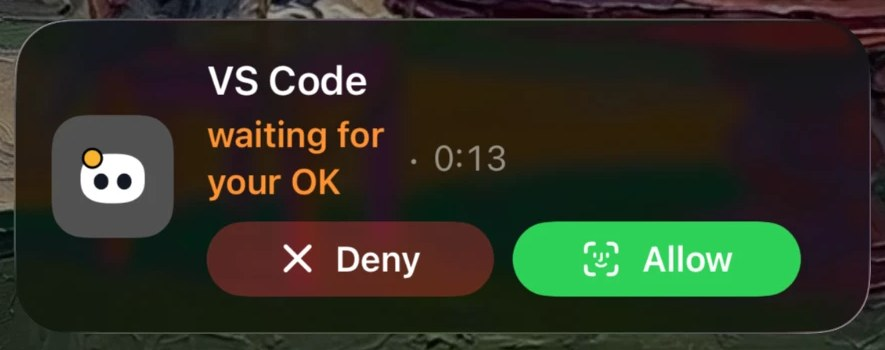

# Coucou on iPhone

Your Mac does the work, your iPhone keeps you in the loop when you step away: your agent sessions live, permission requests you can answer from the Lock Screen, Claude's questions, the next instruction, and your services up close.

<p align="center"></p>

## What you need

| | |
|---|---|
| **Mac** | Coucou **0.1.9 or later** on macOS 15+: the [GitHub build](https://github.com/Louis-CFM/coucou/releases/latest), or the Mac App Store version once it is out |
| **iPhone** | iOS 18 or later. The Lock Screen and Dynamic Island need an iPhone with a Dynamic Island for the island part; every iPhone gets the Lock Screen |
| **iCloud** | The **same Apple Account** signed in to iCloud on the Mac and the iPhone. That's the whole link: no account to create, no server, no pairing code |
| **Coucou on iPhone** | From the App Store (coming soon) or [Join the TestFlight beta](https://testflight.apple.com/join/3GpeHv2b) — free, up to 10,000 testers |

## Get it on your iPhone

1. **Install Coucou on your iPhone.**
   - **App Store:** coming soon, the link will be here.
   - **TestFlight beta:** install [TestFlight](https://apps.apple.com/app/testflight/id899247664) from the App Store, then [Join the TestFlight beta](https://testflight.apple.com/join/3GpeHv2b). The beta is free; Apple limits it to 10,000 testers.
2. **Update Coucou on your Mac** to 0.1.9 or later.
3. **On the Mac:** click the Coucou icon in the menu bar → **Settings… → General → iPhone**, and turn on:
   - **Show my agent sessions on my iPhone** (required)
   - **Move Mochi to my iPhone's Dynamic Island when my Mac is locked** (the Live Activity)
   - **Let my iPhone send instructions to Claude Code** (GitHub build only, optional)
4. **On the iPhone:** open Coucou and allow notifications. That's how permission requests, questions and finished turns reach you.
5. **Start a Claude Code session on the Mac.** It shows up on the iPhone within a few seconds.

Nothing shows up? See [Troubleshooting](#troubleshooting).

## What you can do

| On the iPhone | How |
|---|---|
| **Follow every session live** | Agents tab: each agent's Mochi, its state and steps. Tap one for the last turn: the prompt, what it did (commands and their output), the files it changed with their diffs, and Claude's answer |
| **Allow or Deny a permission** | From the notification, the Lock Screen (Live Activity) or the app. Allow asks for Face ID. Your Mac only applies a decision meant for the exact command it is waiting on, and a request expires after 2 minutes |
| **Answer Claude's questions** | `AskUserQuestion` prompts arrive as a notification with one button per choice, or open the app to answer several at once |
| **Send the next instruction** | Type or dictate in the session screen (GitHub build of the Mac app, with the instructions switch on). Your Mac picks it up within 15 seconds and continues the session in its own folder |
| **Mochi on the Lock Screen** | Lock your Mac while an agent works: Mochi moves to the Lock Screen and the Dynamic Island, then comes back to the notch when you unlock |
| **Your services up close** | Services tab: GitHub, Vercel, Stripe, Cal.com, n8n, Notion, Resend. Your Mac reads their APIs with the keys in its Keychain. Safe actions (re-run failed CI, approve or merge a pull request, redeploy or promote on Vercel, pause or retry an n8n workflow) ask for Face ID first. Nothing that moves money or sends an email |
| **Widgets** | Home Screen and Lock Screen widgets: one Mochi, the team of four, or the list of agents and services |
| **Siri and Shortcuts** | "What are my agents doing in Coucou", "Ask Claude in Coucou" |
| **Control Center** | A control that opens the agent that needs you |
| **Spotlight** | Search the turns you've seen (can be turned off in the app's settings) |
| **Focus** | A Focus filter that only lets approvals and questions through |
| **History** | Your past decisions and turns, grouped by day |

## Privacy

- Your sessions go from your Mac to **your own private iCloud database**, and from there to your iPhone. Project names, commands, paths, questions and turns are encrypted with your iCloud keys.
- **No API key ever leaves your Mac.** The services screen shows what your Mac read; actions are run by your Mac.
- The Live Activity goes through a small relay ([`relay/`](../relay/)) that holds Apple's push key. It only sees the agent's name and state, never a project name, a command or a path, and it stores and logs nothing.
- No account, no analytics. Turning the iPhone switch off on the Mac deletes your sessions from iCloud.

Details in the [privacy policy](https://louis-cfm.github.io/coucou/privacy.html).

## Troubleshooting

**Nothing shows up on the iPhone**
- The Mac and the iPhone must use the **same Apple Account** in iCloud (Settings → your name on the iPhone, System Settings → your name on the Mac).
- On the Mac, **Settings → General → iPhone → Show my agent sessions on my iPhone** must be on, with Coucou 0.1.9 or later.
- Pull down on the Agents tab to refresh.

**No notifications**
- iPhone **Settings → Notifications → Coucou**: allow notifications.
- A Focus mode may hide them: add Coucou to the allowed apps, or use Coucou's Focus filter.
- Check Coucou's own quiet hours in the app's settings.

**Mochi doesn't come to the Lock Screen when I lock my Mac**
- On the Mac, turn on **Move Mochi to my iPhone's Dynamic Island when my Mac is locked**.
- iPhone **Settings → Coucou → Live Activities**: on.
- Open Coucou on the iPhone once after installing it, so it can register with Apple.
- iOS limits how often an app can start a Live Activity from a push. After many lock and unlock cycles in a short time, it may skip a few: it comes back on its own.

**The services screen stays on "Asking your Mac…"**
- Your Mac must be awake with Coucou running, and the service's key saved in the Mac's Settings.

**I can't send instructions**
- Instructions need the GitHub build of the Mac app, with **Let my iPhone send instructions to Claude Code** on.

Still stuck? [Open an issue](https://github.com/Louis-CFM/coucou/issues) or see [Support](https://louis-cfm.github.io/coucou/support.html).

## Build it yourself (developers)

The iPhone app is in this repository (`NotchBuddy/Sources/Phone`, with its widgets in `Sources/Widgets` and the notification card in `Sources/NotificationContent`). It shares Mochi, the pills and the diff engine with the Mac through `Sources/CoucouKit`.

To run it from source on your own iPhone, the Mac app and the iPhone app have to share **your own** iCloud container, because a container belongs to the Apple developer team that signs the app:

1. A paid [Apple Developer Program](https://developer.apple.com/programs/) membership: iCloud (CloudKit) and push notifications aren't available with a free account.
2. In `NotchBuddy/project.yml`, set `bundleIdPrefix` and every `DEVELOPMENT_TEAM` to yours.
3. Replace `iCloud.fr.louisraille.Coucou` with your own container (for example `iCloud.com.you.Coucou`) everywhere it appears: the `.entitlements` files in `NotchBuddy/Resources` and the Swift files under `Sources/App/PhoneLink` and `Sources/Phone` (`grep -rn "iCloud.fr.louisraille.Coucou" NotchBuddy`).
4. Create the container in the [CloudKit console](https://icloud.developer.apple.com/) and run both apps once in Debug: the record types are created in the Development environment.
5. For the Live Activity, deploy your own relay with your APNs key ([`relay/README.md`](../relay/README.md)), set `APNS_TOPIC` in `relay/wrangler.toml` to your iPhone app's bundle ID followed by `.push-type.liveactivity`, and put your relay's address in `LiveActivityRelay.defaultRelayURL`.
6. Build:
   ```bash
   cd NotchBuddy
   xcodegen
   open NotchBuddy.xcodeproj   # scheme NotchBuddy for the Mac, CoucouPhone for the iPhone
   ```

The name Coucou, Mochi, the icon and the sounds are not under the MIT license ([LICENSE-ASSETS.md](../LICENSE-ASSETS.md)): a build for yourself is fine; a build you share needs its own name and character.
